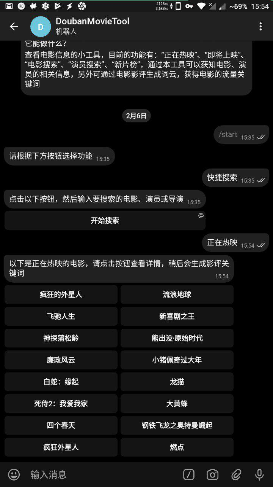
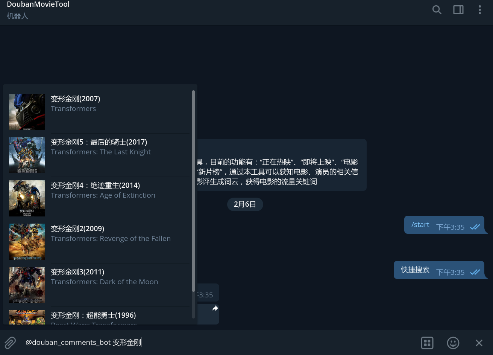

A telegram bot for douban movie
====
> ## 一个tetegeam bot, 关于豆瓣电影的工具。
>
* main.py 为主文件，funcs.py 为基本功能函数，util.py 为辅助模块，config.py中指定token(必须) 与 host(可选，webhook方式使用)。
* 为防止被ban，默认未开启预缓存，如果有必要开启，在main.py中取消注释
  ```python
  if __name__ == '__main__': 
  # util.background()。
* 支持 polling 与 webhook 两种方式，默认使用 webhook 方式，需在 config.py 文件中指定host
* 若使用 polling 方式，按照以下方式设置
  ```python
  # 使用 webhook 方式
  app = Flask(__name__)
  bot = Bot(token=token)
  dispatcher = Dispatcher(bot, None)

  # 使用轮询方式
  # updater = Updater(token)
  # dispatcher = updater.dispatcher
    
  '''
  中间代码
  '''
  
  if __name__ == '__main__':
  util.save_cookie()

  ## 轮询方式
  updater.start_polling()

  ## webhook 方式
  # app.run(host='127.0.0.1',
  #         port=8443)

截图
====
* 功能

* 正在热映

* 快捷搜索


