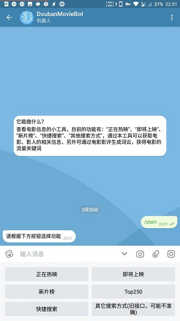

A telegram bot for douban movie，一个tetegeam bot, 关于豆瓣电影的工具。
====
> ## bot 地址：https://t.me/DoubanMovieBot

* run.py --- bot入口文件
* bot_funcs.py --- bot相关功能函数
* data_funcs.py --- 数据获取相关函数，
* utils.py --- 辅助模块
* config.py --- 指定token(必选) ，run_mode(二选一，默认为polling)，host(可选，webhook方式使用)。
* 为防止被ban，默认未开启预缓存，如果有必要开启，在run.py中取消注释 util.background()
  ```python
  if __name__ == '__main__': 
      # util.background()。
      
 
功能 or 特点
====
提供目前有“正在上映”、“即将上映”、“新片榜”、“Top250”、“快捷搜索”等功能，
还有一个基于旧接口实现的搜索（不太准，以后可能遗弃），
通过CustomKeyboardButton、InlineKeyboardButton，InlineQuery，
以及 Instant View 方式呈现输出。

碎碎念:https://www.frost.net.cn/archives/1433

截图
====




